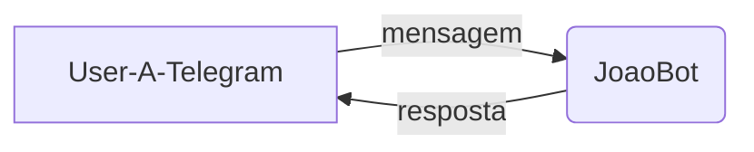

# Criando o primeiro bot Telegram 

[](https://travis-ci.org/joemccann/dillinger)

## Instalando a lib python-bot-telegram
```sh
pip install python-telegram-bot -U --pre
```

## Nossa aplicação 


## Então, o que é o básico ?

- Modelar respostas pre-programadas, para que o usuário possa interagir com o bot.


## Como criar um BOT no telegram com python.
- O primeiro passo é criar um Token, para isso é necessário encaminhar uma mensagem para o **BotFhater** com o comando **/newbot**

- O **BotFhater** deve responder perguntando o identificador do **BOT**, que deve ser informado;
- Em seguida deve-se informar o nome do **BOT**, que deve ser finalizado com Bot, por exemplo, **JoaoBot**;
- Feito isso o BotFhater deverá responder com o TOKEN.


# Código para o primeiro BOT
```python
import logging
from telegram import Update
from telegram.ext import *

logging.basicConfig(
	format='%(asctime)s - %(name)s - %(levelname)s - %(message)s',
	level=logging.INFO
)
async def start(update, context):
	await context.bot.send_message(
		chat_id=update.effective_chat.id,
		text="Olá, eu sou o BOT, como vai?"
	)

app = ApplicationBuilder().token('TOKEN').build()
start_handler = CommandHandler('start', start)
app.add_handler(start_handler)
app.run_polling()
```
Execute o BOT no terminal
````terminal
python bot.py
````
